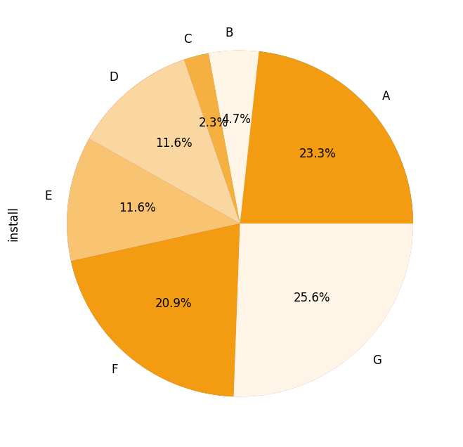

# Introduction
It's the raw data of iOS game app. It's included postback events which in-app game environment.

# Environment
Python, Linux, Hadoop, SQL, and MySQL

# Description of data
=====Subject===== 
[Question] Optimize the app following the KPI 
(1)day1 retention rate below 10% 
(2)nru(new registered users) below 30% 
 
[Information of App] 
Publisher: - 
Category: Game 
OS: iOS 
Language: Korean 
Age: 12+ 
Price: Free 
 
[Information of Event Postback] 
open: app open 
afcompleteregistration: registration 
jointheguild: join the guild 
purchase: purchase 
aflevel5achieved: achieved level 5 aflevel8achieved: achieved level 8 
aflevel10achieved: achieved level 10 aflevel15achieved: achieved level 15 
aflevel20achieved: achieved level 20 autoplay : after level5, it’s allowed autoplay 
 
=====Collect data(.csv file)===== 
Raw data 
(1)channel_event.csv 
(2)d1.csv 
 
Pivoting data (using raw data) 
(1)gagong.csv 
 
[Information of channel_event.csv] 
event: postbacked event name 
channel: channel name 
country: country 
language: language 
os: mobile phone operating system 
device: mobile device 
 
[Information of d1.csv] 
channel: channel name 
install: counted installs 
day1: day 1 retention 
 
[Information of gagong.csv] 
channel: channel name 
install: counted installs 
afcompleteregistration: once a user completed the registration it's pushed(counted) 
aflevel5achieved: achieved level5 
aflevel8achieved: achieved level8 
afpurchase day1: purchase nru: new registered user rate Lv5: achieved level 5 rate purchaserate: purchase rate 
day1_retention: day 1 retention rate 

# Exploratory Analysis
To begin this exploratory analysis, first import libraries and define functions for plotting the data using matplotlib. Depending on the data, not all plots will be made. Once you visualized the data as a graph(the graph file has attached as PNG file), you will find each character of channels.

KPI Option1 : day1_retention
As you analyzed the data, you could see the Channel A, C, D, E, and F were not following KPI #1(day1 RR below 10%). On the other hand, the channel B, G are satisfied the KPI so that they need to be optimization

KPI Option 2 : NRU(New Registered Users)
You could see the Channel A, B were not following KPI #2(nru below 30%). On the other hand, the channel C, D, E, F, and G are satisfied the KPI so that they need to be optimization

# Conclusion
  
Except for channel A, other channels B, C, D, E, F, and G are needed to be optimized following the KPI. It's around 76.7% of total installs. 
(Total_install_pie.png) In order to reduce this ratio, you would be better channel G with the most installs (number of cases) will be optimized first, followed by channels F, D, E, B, and C in order.

